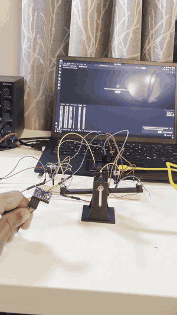

# Pitch-Axis Stabilization Loop

A single-axis flight controller on an ESP32: an MPU6050 is fused with a complementary
filter to estimate pitch, and a PID loop drives two brushed motors to hold the arm level
against artificial disturbances.

## Demo

The arm is knocked off level by hand and the loop drives it back to the setpoint.

## How it works

- **Sensing** — MPU6050 over I²C; accelerometer gives absolute pitch, gyro gives rate.
- **Estimation** — complementary filter (`ALPHA = 0.98`) blends gyro integration with the
  accelerometer angle to get a drift-free, low-noise pitch.
- **Control** — PID on pitch error, with integral clamping and an output limit to keep
  corrections inside motor range.
- **Actuation** — 20 kHz / 10-bit LEDC PWM to two motors, mixed differentially around a
  base throttle.

Live tuning of `Kp`/`Ki`/`Kd`, setpoint, base throttle, and mix sign is exposed over the
serial console, so gains can be adjusted in real-time without reflashing.
